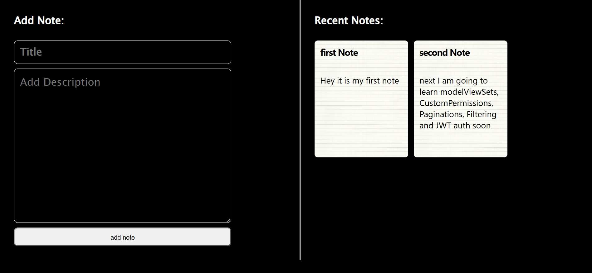

# Simple Notes App 📝

This is my very first full-stack project built to master client-server communication! The primary goal of this project was to establish a clean API connection between a React frontend and a Django REST Framework backend.

## 🖼️ Application Preview

## 🚀 Tech Stack
* **Frontend:** React.js
* **Backend:** Django REST Framework (DRF)
* **Database:** SQLite
* **API Architecture:** RESTful Endpoints

## 💡 Key Features & Learnings
* **GET Requests:** Fetching and dynamically displaying notes from the backend database.
* **POST Requests:** Sending new user input securely to the backend via API endpoints.
* **State Management:** Updating React state based on live API responses.
* **CORS Handling:** Configuring Cross-Origin Resource Sharing between React and DRF.

## 🔄 What's Next?
This project marks my starting line for full-stack engineering! My immediate next step is to upgrade this application with full CRUD functionality (PUT/DELETE), JWT-based user authentication, and advanced AI integrations.
